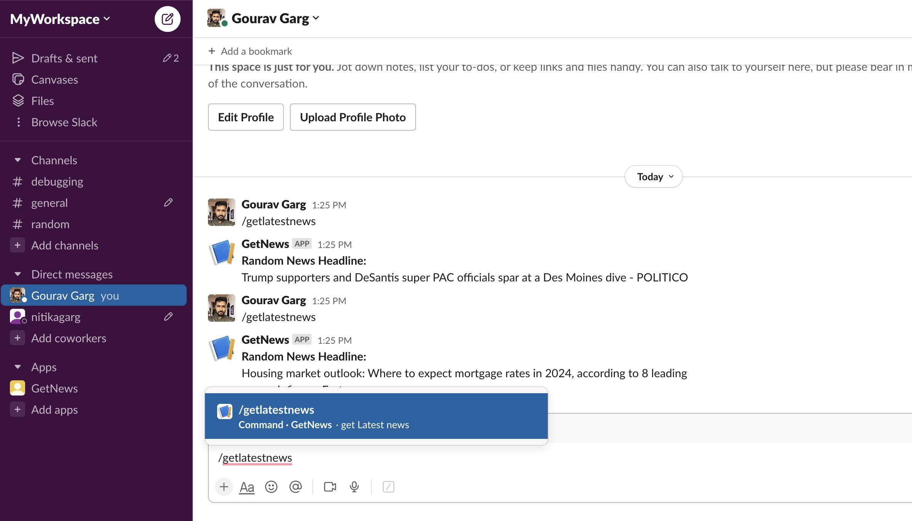

# Slack News App - Get Random Headline
This Node.js application is a Slack integration that allows users to retrieve a random news headline using a slash command. It uses the News API to fetch news headlines and displays them in a Slack channel.

## Setup and Usage

Follow these steps to set up and run the "Get Random Headline" Slack app :

### Clone the Repository

```sh
git clone https://github.com/gauravgarg26/slackApp.git
cd slack-news-app
```

### Run
```sh
- npm install
- npm test - it will show the message - Test passed successfully!
- npm start - it will start the server on 3003
```

then make a post request to /randomheadline path and it will return latest headline in block kit message.

## Additional
I also deployed the code on server.
Request URL - POST : https://dizzy-gray-sawfish.cyclic.cloud/randomheadline

Also established the Slack app by creating a new workspace with configured slash command **"/getlatestnews"**.

